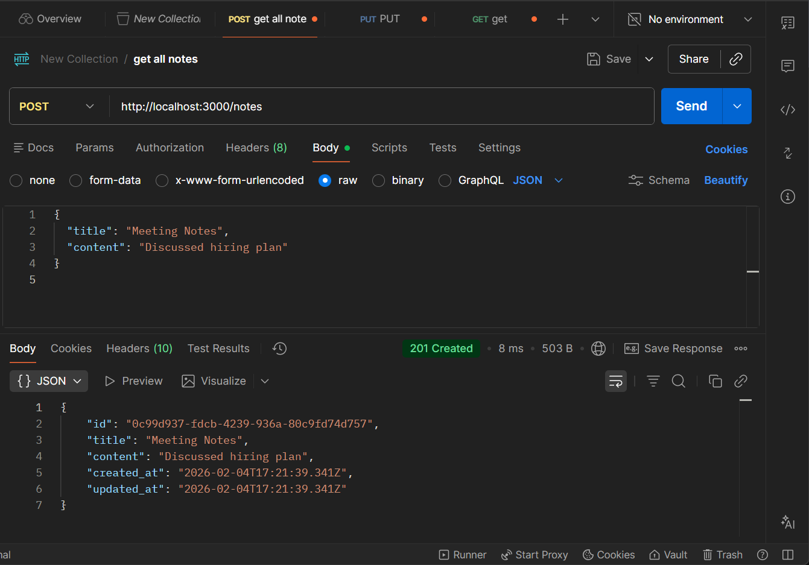

# Notes Management API 📝

A minimal, intelligent REST API built with **Node.js** and **Express**. This project goes beyond basic CRUD by implementing validation, rate limiting, and smart search logic.

---

## 🚀 Features

* **Smart Creation:** Validates `title` and `content`. Rejects empty strings and trims extra whitespace.
* **Rate Limiting:** Security-first approach limiting users to **5 note creations per minute**.
* **Advanced Search:** Case-insensitive partial matching across both titles and content.
* **Optimized Updates:** `updated_at` only refreshes if the data actually changes.
* **Sorting:** Automatically returns notes sorted by the most recently updated.

---

## 🛠 Tech Stack

* **Runtime:** Node.js
* **Framework:** Express.js
* **Utilities:** `uuid`, `express-rate-limit`

---

## 📑 API Endpoints & Usage

### 1. Create a Note (`POST /notes`)

**Description:** Validates input and creates a unique note.

> *Example success response: `201 Created`

### 2. Update a Note (`PUT /notes/:id`)

**Description:** Performs partial updates. If the new data is identical to the old data, it notifies the user without changing the timestamp.

> *Example success response: `200 OK - No changes detected*`


| Method | Endpoint | Description |
| --- | --- | --- |
| **POST** | `/notes` | Create a note (Rate limited) |
| **GET** | `/notes` | Get all notes (Sorted) |
| **PUT** | `/notes/:id` | Update existing note |
| **GET** | `/notes/search` | Search by keyword |

---

## 💻 Setup & Installation

1. **Clone and Install**
```bash
git clone https://github.com/Amandot/notes_api.git
cd notes-management-api
npm install

```


2. **Run the Server**
```bash
node index.js

```


*Server running at: `http://localhost:3000`*
